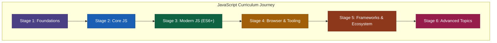

# 🚀 JavaScript Learning Path & Roadmap

Welcome to the ultimate JavaScript curriculum! This repository contains a structured, hands-on learning journey designed to take you from core programming concepts to advanced architectural topics.

Each topic on the roadmap is paired with an interactive, fully commented reference script/file in this workspace.

---

## 🎨 Practice Projects

To put these concepts into practice, check out the companion repository:
👉 **[JavaScript Mini Projects Collection](https://github.com/VIJAYAPANDIANT/JavaScript-Mini-Projects)** - A curated collection of 13 beginner-to-intermediate web applications built with Vanilla JavaScript, HTML5, and CSS3.

---

## 🎥 Recommended Resources

This curriculum is structured around the learning path of:
👉 **[Bro Code's JavaScript Course on YouTube](https://youtu.be/lfmg-EJ8gm4?si=h4OwsdG-cp5kUxP0)** - A comprehensive, beginner-friendly video course covering core JavaScript concepts.
👉 **[Claude AI](https://claude.ai)** - An AI assistant by Anthropic used for learning, debugging, and explaining complex concepts.

---

## 🗺️ High-Level Roadmap



---

## 📚 Stage-by-Stage Curriculum

### 🟣 Stage 1 — Foundations
Getting started with the core syntax, block/lexical scopes, operators, control flow, functions, arrays, and objects.

| Topic / Node | Details / Core Concepts | Reference Lesson File |
|:---|:---|:---|
| **Syntax & Variables** | Introduction, printing, types, `var`, `let`, `const`, scope, TDZ, type coercion, explicit casting, comments | 📄 [Basic Js.js](Basic%20Js.js)<br>📄 [Variables.js](Variables.js)<br>📄 [Data type.js](Data%20type.js)<br>📄 [Casting.js](Casting.js)<br>📄 [Comment.js](Comment.js) |
| **Operators** | Arithmetic, assignment, comparison, logical, bitwise, ternary, nullish coalescing | 📄 [Operators.js](Operators.js) |
| **Control Flow** | Conditionals (`if/else`, `switch`), loops (`for`, `while`, `do-while`), jump statements | 📄 [Control flow.js](Control%20flow.js) |
| **Functions** | Function declarations, expressions, arrows, scopes, parameters, arguments, return statements | 📄 [Functions.js](Functions.js) |
| **Arrays** | Array methods (`map`, `filter`, `reduce`, `forEach`, `find`, `some`, `every`) | 📄 [Arrays.js](Arrays.js) |
| **Objects** | Key-value pairs, object creation, object methods, references, execution context | 📄 [Objects.js](Objects.js) |

---

### 🔵 Stage 2 — Core JS
Mastering the browser's Document Object Model, events, built-in helper methods, closure patterns, and execution scopes.

| Topic / Node | Details / Core Concepts | Reference Lesson File |
|:---|:---|:---|
| **DOM** | Selecting, creating, updating, styling, and deleting HTML nodes | 📄 [DOM.js](DOM.js) |
| **Events** | Event listeners, event object, event bubbling, capturing, event delegation | 📄 [Events.js](Events.js) |
| **String methods** | String operations (`slice`, `split`, `substring`, `trim`, `replace`, template literals) | 📄 [String methods.js](String%20methods.js) |
| **Error handling** | Catching errors synchronously with `try/catch/finally`, custom `Error` classes | 📄 [Error handling.js](Error%20handling.js) |
| **Closures & scope** | Lexical environment, closures, factory patterns, state preservation | 📄 [Closures and scope.js](Closures%20and%20scope.js) |
| **this keyword** | Implicit/explicit binding, Arrow functions behavior, `call()`, `apply()`, `bind()` | 📄 [This keyword.js](This%20keyword.js) |
| **Browser Dialogs** | Interactive modal dialogs blocking thread execution: `alert`, `confirm`, `prompt` | 📄 [Alert.html](Alert.html) |

---

### 🟢 Stage 3 — Modern JS (ES6+)
Modern ES6 syntactic sugar, modules, Object-Oriented programming in JS, asynchronous code, and protocol fetching.

| Topic / Node | Details / Core Concepts | Reference Lesson File |
|:---|:---|:---|
| **Destructuring** | Array/object destructuring, alias matching, default parameters, rest/spread operators (`...`) | 📄 [Destructuring.js](Destructuring.js) |
| **Modules** | Modularity, exports, imports, ES Modules (ESM) | 📄 [Modules.js](Modules.js) |
| **Classes & OOP** | JavaScript prototypes, classes, inheritance, constructor, statics, private variables | 📄 [Classes and OOP.js](Classes%20and%20OOP.js) |
| **Async JS** | Callback hell, Promises (`resolve`, `reject`, chaining), `async`/`await` patterns | 📄 [Async JS.js](Async%20JS.js) |
| **Fetch & APIs** | Client-server communication, JSON parser, `fetch()` interface, RESTful methods | 📄 [Fetch and APIs.js](Fetch%20and%20APIs.js) |
| **Iterators & generators** | Symbol.iterator protocol, custom iterators, generator functions, `yield` keyword | 📄 [Iterators and generators.js](Iterators%20and%20generators.js) |

---

### 🟡 Stage 4 — Browser & Tooling
Storage interfaces, advanced web client interfaces, module bundling, test runners, type systems, and style tools.

| Topic / Node | Details / Core Concepts | Reference Lesson File |
|:---|:---|:---|
| **Web storage** | Persistent client storage with LocalStorage, SessionStorage, and Cookies | 📄 [Web storage.js](Web%20storage.js) |
| **Browser APIs** | Client device interfaces, Web Workers, Canvas, Geolocation | 📄 [Browser APIs.js](Browser%20APIs.js) |
| **Tooling** | Packages (`npm`), bundlers (`Webpack`, `Vite`), compilers (`Babel`) | 📄 [Tooling.js](Tooling.js) |
| **Testing** | Automated testing, Test-Driven Development (TDD), mocking, unit testing with `Jest`/`Vitest` | 📄 [Testing.js](Testing.js) |
| **TypeScript** | Static analysis, static typing, types, interfaces, generics | 📄 [TypeScript.ts](TypeScript.ts) |
| **Code quality** | Linting rules, automated formatting, git hooks using `ESLint`, `Prettier`, `Husky` | 📄 [Code quality.js](Code%20quality.js) |

---

### 🟠 Stage 5 — Frameworks & Ecosystem
Moving beyond plain JS to modern frontend frameworks, server systems, and client/global state stores.

| Topic / Node | Details / Core Concepts | Reference Lesson File |
|:---|:---|:---|
| **React** | Virtual DOM, JSX syntax, functional components, hooks (`useState`, `useEffect`) | 📄 [React.jsx](React.jsx) |
| **Vue.js** | Single File Components (SFC), reactivity engine, options/composition API | 📄 [Vue.vue](Vue.vue) |
| **Svelte / Angular** | Compiler-based reactivity (Svelte) vs modular structured frameworks (Angular) | 📄 [Svelte and Angular.js](Svelte%20and%20Angular.js) |
| **Next.js / Nuxt** | Server-Side Rendering (SSR), Static Site Generation (SSG), file-system routing | 📄 [Next.js and Nuxt.js](Next.js%20and%20Nuxt.js) |
| **Node.js & Express** | Server-side runtime environment, REST APIs, Express framework middleware | 📄 [Node.js and Express.js](Node.js%20and%20Express.js) |
| **State management** | Global state stores, unidirectional flux patterns: Redux, Zustand, Pinia | 📄 [State management.js](State%20management.js) |

---

### 🔴 Stage 6 — Advanced Topics
System performance, cyber security, coding patterns, JavaScript single-thread architecture, real-time protocols, and offline apps.

| Topic / Node | Details / Core Concepts | Reference Lesson File |
|:---|:---|:---|
| **Performance** | Performance optimization, `debounce`/`throttle` implementation, lazy loading | 📄 [Performance.js](Performance.js) |
| **Security** | Cross-Site Scripting (XSS), CSRF tokens, secure headers, user input sanitization | 📄 [Security.js](Security.js) |
| **Design patterns** | Reusable designs: Observer pattern, Factory pattern, Singleton pattern | 📄 [Design patterns.js](Design%20patterns.js) |
| **Event loop** | Single-threaded engine, call stack, Web APIs queue, microtask & macrotask execution | 📄 [Event loop.js](Event%20loop.js) |
| **Real-time** | Bi-directional communication protocols: WebSockets, Server-Sent Events (SSE) | 📄 [Real-time.js](Real-time.js) |
| **PWA & service workers** | Progressive Web Apps (PWA), network interceptors, offline caching, app manifest | 📄 [PWA and service workers.js](PWA%20and%20service%20workers.js) |

---

## 🏃 How to Run the Lesson Scripts

1. **Clone the Repository:**
   ```bash
   git clone https://github.com/VIJAYAPANDIANT/JavaScript.git
   ```

2. **Execute scripts locally in terminal:**
   Ensure you have [Node.js](https://nodejs.org) installed, then execute:
   ```bash
   node "Variables.js"
   node "DOM.js"
   ```

3. **Open browser exercises:**
   For browser-specific files (e.g., `Alert.html`), double-click to open them in any standard web browser or run with a local live-reload tool (like Live Server in VS Code, Vite, etc.).

---

## 🤝 Contributing

Contributions are welcome! If you'd like to improve the lessons, add examples, or fix typos:
1. **Fork** the repository.
2. Create your feature branch (`git checkout -b feature/improvement`).
3. Commit your changes (`git commit -m 'Improve scope explanation'`).
4. Push to the branch (`git push origin feature/improvement`).
5. Open a **Pull Request**.
